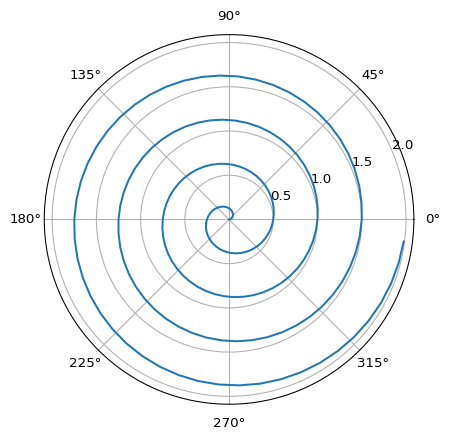

# Quarto Basics

For a demonstration of a line plot on a polar axis, see
[Figure 1](#fig-polar).

<details>
<summary>Code</summary>

``` python
import numpy as np
import matplotlib.pyplot as plt

r = np.arange(0, 2, 0.01)
theta = 4 * np.pi * r
fig, ax = plt.subplots(
  subplot_kw = {'projection': 'polar'} 
)
ax.plot(theta, r)
ax.set_rticks([0.5, 1, 1.5, 2])
ax.grid(True)
plt.show()
```

</details>



Function for continuous variable, see @function.

<details>
<summary>Code</summary>

``` python
import numpy as np
import pandas as pd
df = pd.read_csv(r"E:\source\repos\OrionSummerInternship-2023\data\raw\train.csv")
df
```

</details>
<div>
<style scoped>
    .dataframe tbody tr th:only-of-type {
        vertical-align: middle;
    }
&#10;    .dataframe tbody tr th {
        vertical-align: top;
    }
&#10;    .dataframe thead th {
        text-align: right;
    }
</style>

|      | Id   | MSSubClass | MSZoning | LotFrontage | LotArea | Street | Alley | LotShape | LandContour | Utilities | ... | PoolArea | PoolQC | Fence | MiscFeature | MiscVal | MoSold | YrSold | SaleType | SaleCondition | SalePrice |
|------|------|------------|----------|-------------|---------|--------|-------|----------|-------------|-----------|-----|----------|--------|-------|-------------|---------|--------|--------|----------|---------------|-----------|
| 0    | 1    | 60         | RL       | 65.0        | 8450    | Pave   | NaN   | Reg      | Lvl         | AllPub    | ... | 0        | NaN    | NaN   | NaN         | 0       | 2      | 2008   | WD       | Normal        | 208500    |
| 1    | 2    | 20         | RL       | 80.0        | 9600    | Pave   | NaN   | Reg      | Lvl         | AllPub    | ... | 0        | NaN    | NaN   | NaN         | 0       | 5      | 2007   | WD       | Normal        | 181500    |
| 2    | 3    | 60         | RL       | 68.0        | 11250   | Pave   | NaN   | IR1      | Lvl         | AllPub    | ... | 0        | NaN    | NaN   | NaN         | 0       | 9      | 2008   | WD       | Normal        | 223500    |
| 3    | 4    | 70         | RL       | 60.0        | 9550    | Pave   | NaN   | IR1      | Lvl         | AllPub    | ... | 0        | NaN    | NaN   | NaN         | 0       | 2      | 2006   | WD       | Abnorml       | 140000    |
| 4    | 5    | 60         | RL       | 84.0        | 14260   | Pave   | NaN   | IR1      | Lvl         | AllPub    | ... | 0        | NaN    | NaN   | NaN         | 0       | 12     | 2008   | WD       | Normal        | 250000    |
| ...  | ...  | ...        | ...      | ...         | ...     | ...    | ...   | ...      | ...         | ...       | ... | ...      | ...    | ...   | ...         | ...     | ...    | ...    | ...      | ...           | ...       |
| 1455 | 1456 | 60         | RL       | 62.0        | 7917    | Pave   | NaN   | Reg      | Lvl         | AllPub    | ... | 0        | NaN    | NaN   | NaN         | 0       | 8      | 2007   | WD       | Normal        | 175000    |
| 1456 | 1457 | 20         | RL       | 85.0        | 13175   | Pave   | NaN   | Reg      | Lvl         | AllPub    | ... | 0        | NaN    | MnPrv | NaN         | 0       | 2      | 2010   | WD       | Normal        | 210000    |
| 1457 | 1458 | 70         | RL       | 66.0        | 9042    | Pave   | NaN   | Reg      | Lvl         | AllPub    | ... | 0        | NaN    | GdPrv | Shed        | 2500    | 5      | 2010   | WD       | Normal        | 266500    |
| 1458 | 1459 | 20         | RL       | 68.0        | 9717    | Pave   | NaN   | Reg      | Lvl         | AllPub    | ... | 0        | NaN    | NaN   | NaN         | 0       | 4      | 2010   | WD       | Normal        | 142125    |
| 1459 | 1460 | 20         | RL       | 75.0        | 9937    | Pave   | NaN   | Reg      | Lvl         | AllPub    | ... | 0        | NaN    | NaN   | NaN         | 0       | 6      | 2008   | WD       | Normal        | 147500    |

<p>1460 rows × 81 columns</p>
</div>
