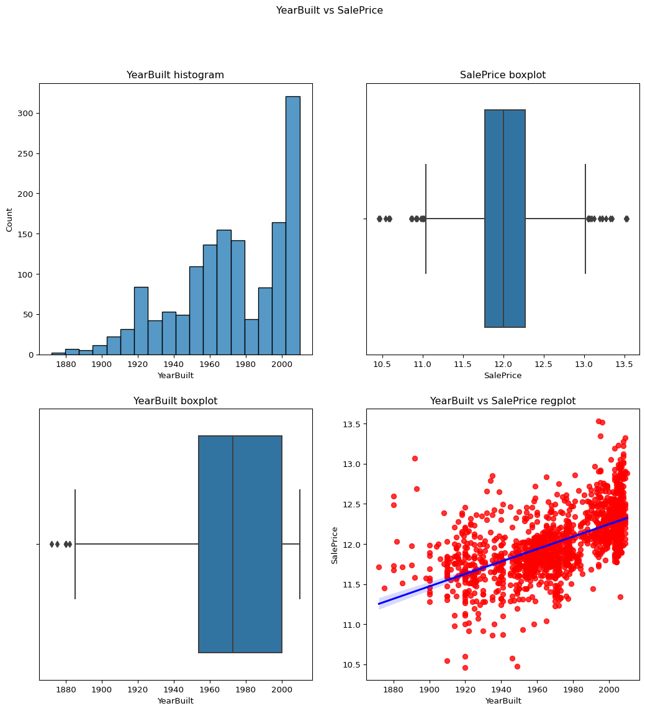
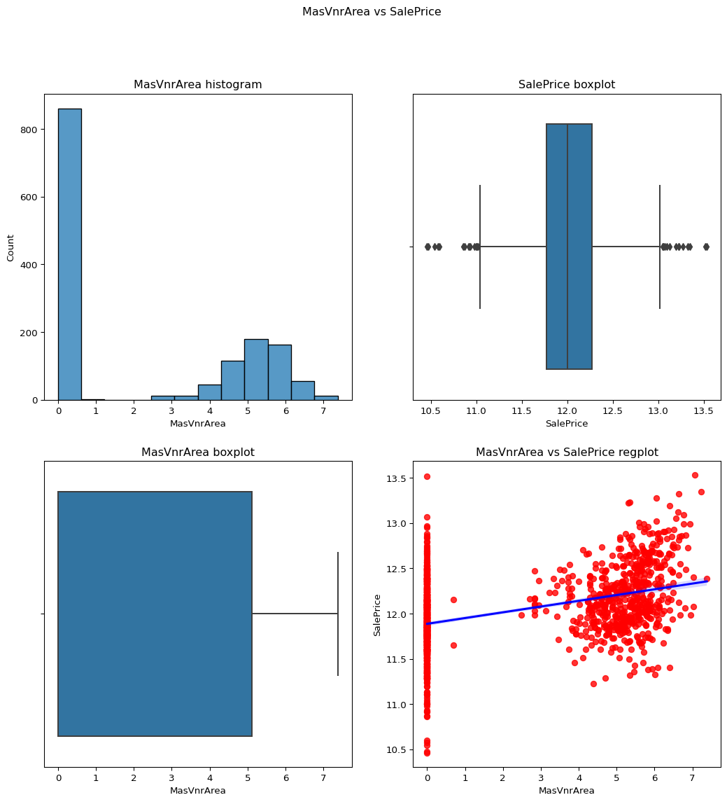
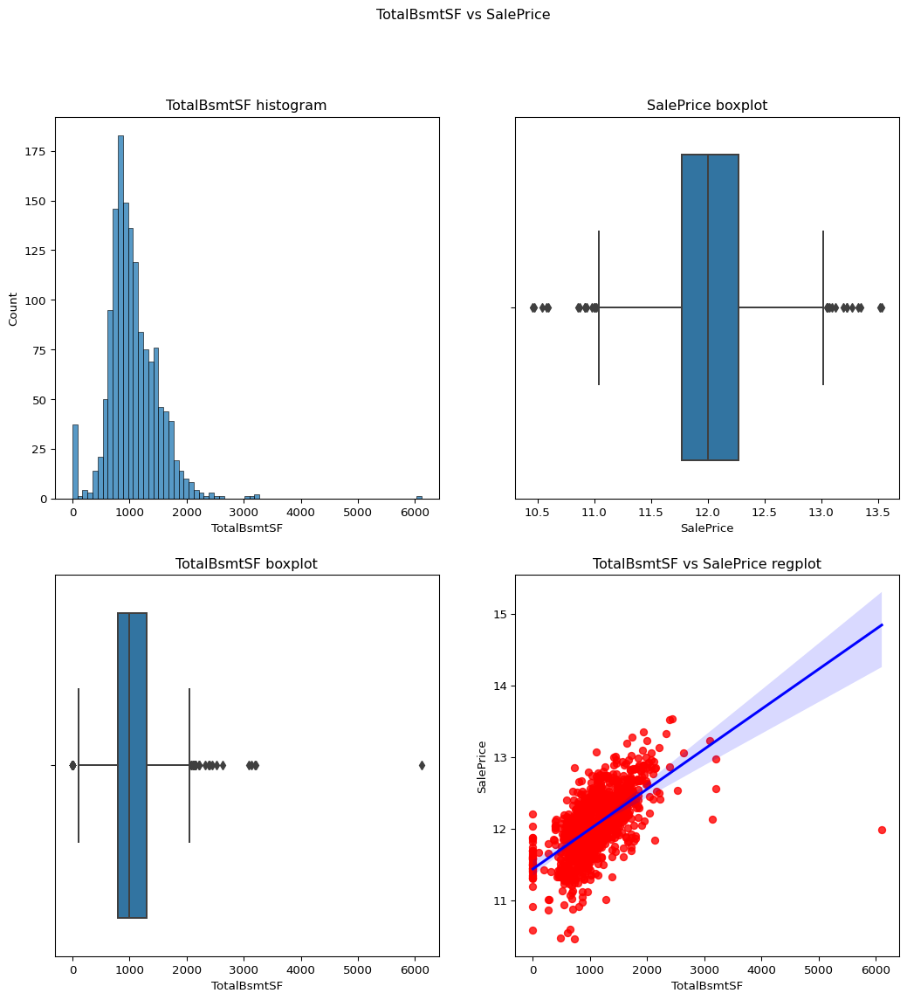
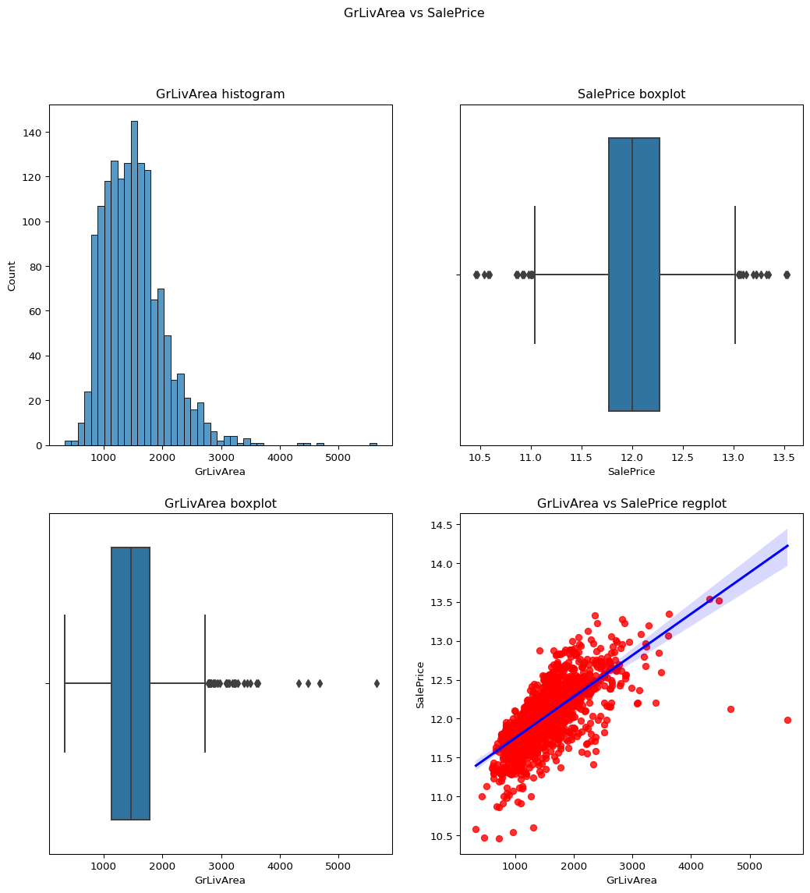
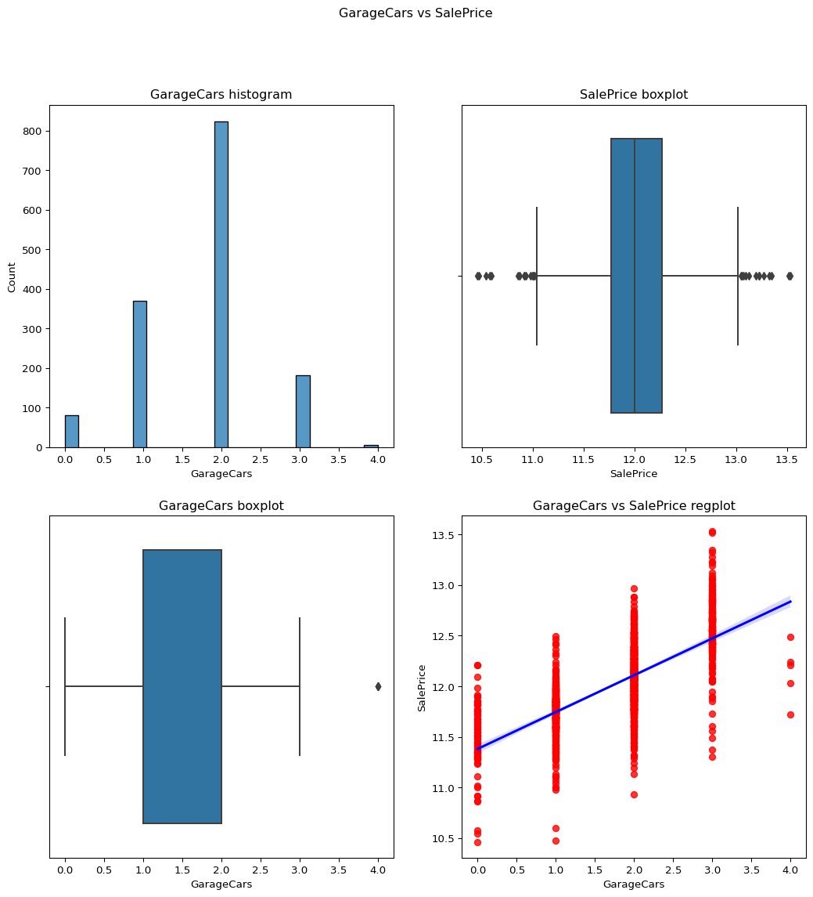
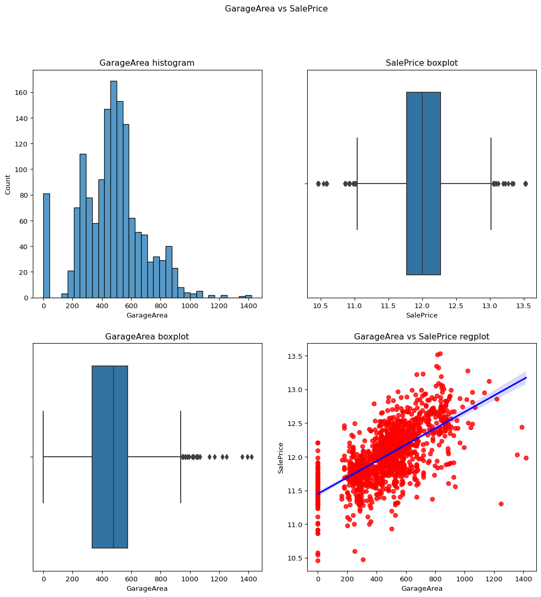
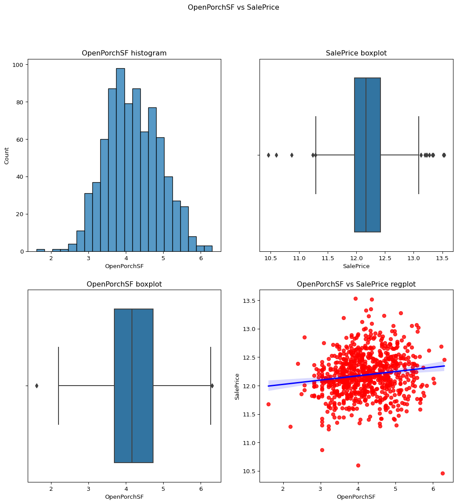
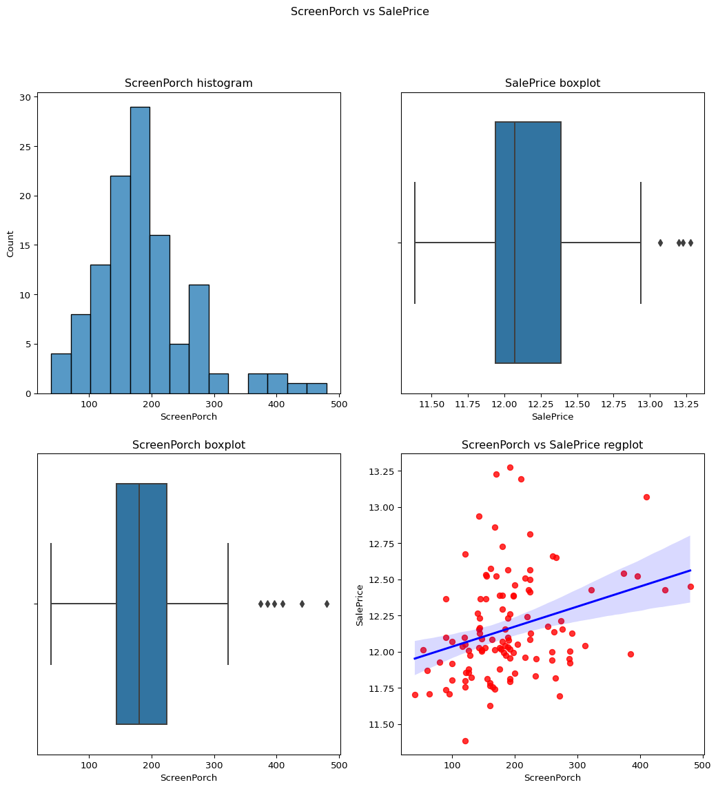

# Quarto Basics

For a demonstration of a line plot on a polar axis, see
[Figure 1](#fig-polar).

<details>
<summary>Code</summary>

``` python
import numpy as np
import matplotlib.pyplot as plt

r = np.arange(0, 2, 0.01)
theta = 4 * np.pi * r
fig, ax = plt.subplots(
  subplot_kw = {'projection': 'polar'} 
)
ax.plot(theta, r)
ax.set_rticks([0.5, 1, 1.5, 2])
ax.grid(True)
plt.show()
```

</details>


<details>
<summary>Code</summary>

``` python
import os
from dotenv import load_dotenv

load_dotenv()  # take environment variables from .env.
#ROOT_DIR1 =  os.environ.get("ROOT_DIR") 
#print(ROOT_DIR1)
ROOT_DIR =  os.environ.get("ROOT_DIR2") 
print(ROOT_DIR)
```

</details>

    E:/source/repos/OrionSummerInternship-2023

<details>
<summary>Code</summary>

``` python
import os
os.chdir(ROOT_DIR)
import numpy as np
import pandas as pd
import seaborn as sb
from sklearn.preprocessing import LabelEncoder
from src.util import catgvssale,contvssale,contvscont,check_column_skewness,remove_skewness,plot_contv,remove_ngskewness
from datetime import datetime
df = pd.read_csv( "data/raw/train.csv")
temp_df=df
```

</details>
<details>
<summary>Code</summary>

``` python
numerics =['int16','int32','int64','float16','float32','float64']
numcol = df.select_dtypes(include=numerics)
len(numcol)
numcol
```

</details>
<div>
<style scoped>
    .dataframe tbody tr th:only-of-type {
        vertical-align: middle;
    }
&#10;    .dataframe tbody tr th {
        vertical-align: top;
    }
&#10;    .dataframe thead th {
        text-align: right;
    }
</style>

|      | Id   | MSSubClass | LotFrontage | LotArea | OverallQual | OverallCond | YearBuilt | YearRemodAdd | MasVnrArea | BsmtFinSF1 | ... | WoodDeckSF | OpenPorchSF | EnclosedPorch | 3SsnPorch | ScreenPorch | PoolArea | MiscVal | MoSold | YrSold | SalePrice |
|------|------|------------|-------------|---------|-------------|-------------|-----------|--------------|------------|------------|-----|------------|-------------|---------------|-----------|-------------|----------|---------|--------|--------|-----------|
| 0    | 1    | 60         | 65.0        | 8450    | 7           | 5           | 2003      | 2003         | 196.0      | 706        | ... | 0          | 61          | 0             | 0         | 0           | 0        | 0       | 2      | 2008   | 208500    |
| 1    | 2    | 20         | 80.0        | 9600    | 6           | 8           | 1976      | 1976         | 0.0        | 978        | ... | 298        | 0           | 0             | 0         | 0           | 0        | 0       | 5      | 2007   | 181500    |
| 2    | 3    | 60         | 68.0        | 11250   | 7           | 5           | 2001      | 2002         | 162.0      | 486        | ... | 0          | 42          | 0             | 0         | 0           | 0        | 0       | 9      | 2008   | 223500    |
| 3    | 4    | 70         | 60.0        | 9550    | 7           | 5           | 1915      | 1970         | 0.0        | 216        | ... | 0          | 35          | 272           | 0         | 0           | 0        | 0       | 2      | 2006   | 140000    |
| 4    | 5    | 60         | 84.0        | 14260   | 8           | 5           | 2000      | 2000         | 350.0      | 655        | ... | 192        | 84          | 0             | 0         | 0           | 0        | 0       | 12     | 2008   | 250000    |
| ...  | ...  | ...        | ...         | ...     | ...         | ...         | ...       | ...          | ...        | ...        | ... | ...        | ...         | ...           | ...       | ...         | ...      | ...     | ...    | ...    | ...       |
| 1455 | 1456 | 60         | 62.0        | 7917    | 6           | 5           | 1999      | 2000         | 0.0        | 0          | ... | 0          | 40          | 0             | 0         | 0           | 0        | 0       | 8      | 2007   | 175000    |
| 1456 | 1457 | 20         | 85.0        | 13175   | 6           | 6           | 1978      | 1988         | 119.0      | 790        | ... | 349        | 0           | 0             | 0         | 0           | 0        | 0       | 2      | 2010   | 210000    |
| 1457 | 1458 | 70         | 66.0        | 9042    | 7           | 9           | 1941      | 2006         | 0.0        | 275        | ... | 0          | 60          | 0             | 0         | 0           | 0        | 2500    | 5      | 2010   | 266500    |
| 1458 | 1459 | 20         | 68.0        | 9717    | 5           | 6           | 1950      | 1996         | 0.0        | 49         | ... | 366        | 0           | 112           | 0         | 0           | 0        | 0       | 4      | 2010   | 142125    |
| 1459 | 1460 | 20         | 75.0        | 9937    | 5           | 6           | 1965      | 1965         | 0.0        | 830        | ... | 736        | 68          | 0             | 0         | 0           | 0        | 0       | 6      | 2008   | 147500    |

<p>1460 rows × 38 columns</p>
</div>
<details>
<summary>Code</summary>

``` python
missingper = df.isna().sum().sort_values(ascending=False)/len(df)
missingper.head(10)
miss_col = missingper[missingper!=0]
miss_col
miss_col.head(19)
```

</details>

    PoolQC          0.995205
    MiscFeature     0.963014
    Alley           0.937671
    Fence           0.807534
    MasVnrType      0.597260
    FireplaceQu     0.472603
    LotFrontage     0.177397
    GarageYrBlt     0.055479
    GarageCond      0.055479
    GarageType      0.055479
    GarageFinish    0.055479
    GarageQual      0.055479
    BsmtFinType2    0.026027
    BsmtExposure    0.026027
    BsmtQual        0.025342
    BsmtCond        0.025342
    BsmtFinType1    0.025342
    MasVnrArea      0.005479
    Electrical      0.000685
    dtype: float64

## Columns with NO Missing_Values

<details>
<summary>Code</summary>

``` python
nomiss_col = missingper[missingper == 0]
nomiss_col
nomiss_col.info()
nomiss_col.head(15)
```

</details>

    <class 'pandas.core.series.Series'>
    Index: 62 entries, Id to SalePrice
    Series name: None
    Non-Null Count  Dtype  
    --------------  -----  
    62 non-null     float64
    dtypes: float64(1)
    memory usage: 992.0+ bytes

    Id              0.0
    Functional      0.0
    Fireplaces      0.0
    KitchenQual     0.0
    KitchenAbvGr    0.0
    BedroomAbvGr    0.0
    HalfBath        0.0
    FullBath        0.0
    BsmtHalfBath    0.0
    TotRmsAbvGrd    0.0
    GarageCars      0.0
    GrLivArea       0.0
    GarageArea      0.0
    PavedDrive      0.0
    WoodDeckSF      0.0
    dtype: float64

## Target:SalePrie

<details>
<summary>Code</summary>

``` python
#plot_contv(contvar="SalePrice",df=df)
remove_skewness(df,"SalePrice")
check_column_skewness(df,"SalePrice")
plot_contv(contvar="SalePrice",df=df)
```

</details>


## MSSubClass

<details>
<summary>Code</summary>

``` python
catgvssale(catgvar="MSSubClass",df=df)
check_column_skewness(df,"MSSubClass")
```

</details>

    1.4076567471495591


## LotFrontage

checking the skewness of a temporary df which does not include the
values of the column LotFrontage which has value 0 and plotting it
against the salePrice to check whether it is suitable for the model or
not. skewness before log transform is 2.1635691423248837. now removing
the skewness and checking the value againa and plotting it again to see
the difference. skewness atfer log transform = -0.7287278423055492

<details>
<summary>Code</summary>

``` python
temp_df = df.loc[df['LotFrontage']!=0]
remove_skewness(temp_df,"LotFrontage")
check_column_skewness(temp_df,"LotFrontage")
contvssale(contvar="LotFrontage",df=temp_df)
```

</details>


## LotArea

Skewness = -0.1374044. The value is acceptable as it has already been
transformed using the log transformation.

<details>
<summary>Code</summary>

``` python
remove_skewness(temp_df,"LotArea")
contvssale(contvar="LotArea",df=temp_df)
```

</details>


## YearBuilt

Skewness = -0.6134611. As the skewness of the column is already less
than 1 there is no need to apply the log transformation.

<details>
<summary>Code</summary>

``` python
contvssale(contvar="YearBuilt",df=temp_df)
check_column_skewness(temp_df,"YearBuilt")
```

</details>

    -0.613461172488183



## YearRemodAdd

Skewness=-0.503562002. As from the below countplot, boxplot and regplot
we can see that this data is not skewed.

<details>
<summary>Code</summary>

``` python
contvssale(contvar="YearRemodAdd",df=df)
```

</details>


## YearRemodAdd vs YearBuilt

<details>
<summary>Code</summary>

``` python
contvscont(contvar="YearBuilt",df=df,tarvar="YearRemodAdd")
```

</details>


## MasVnrArea

skewness = 2.677616. From the below graph we can see that this data is a
little positively skewed so we can apply here log transformation.
skewness after = 0.50353171.

<details>
<summary>Code</summary>

``` python
op = remove_skewness(df,"MasVnrArea")
check_column_skewness(df,"MasVnrArea")
contvssale(contvar="MasVnrArea",df=df)
```

</details>



## BsmtFinSF1–

skewness = 1.685503071910789. From the regression plot as well as
boxplot we can say that this data is slightly skewed as it has more
confidence in the regression plot. skewness = -0.618409817855514.

<details>
<summary>Code</summary>

``` python
remove_skewness(df,"BsmtFinSF1")
check_column_skewness(df,"BsmtFinSF1")
temp_df = df.loc[df['BsmtFinSF1']!=0]
contvssale(contvar="BsmtFinSF1",df=temp_df)
check_column_skewness(temp_df,"BsmtFinSF1")
```

</details>

    -1.8212926673745269


## BsmtFinSF2: Type 2 finished square feet

skewness = 4.255261108933303. The data is positively skewed and may
impact our model so we apply log transform. skewness =
2.434961825856814. After removing the 0 values we get the column with
skewness which is less than 1. skewness = 0.9942372017307054

<details>
<summary>Code</summary>

``` python
remove_skewness(df,"BsmtFinSF2")
check_column_skewness(df,"BsmtFinSF2")
temp_df = df.loc[df['BsmtFinSF2']!=0]
contvssale(contvar="BsmtFinSF2",df=temp_df)
check_column_skewness(temp_df,"BsmtFinSF2")
```

</details>

    -0.5937670428573839


## TotalBsmtSF: Total square feet of basement

skewness = 1.5242545490627664

<details>
<summary>Code</summary>

``` python
contvssale(contvar="TotalBsmtSF",df=df)
```

</details>



## GrLivArea: Above grade (ground) living area square feet

skewness = 1.3665603560164552. The skewness of this data is accepable so
no need to apply the log transfrom as it would make it negatively
skewed.

<details>
<summary>Code</summary>

``` python
contvssale(contvar="GrLivArea",df=df)
check_column_skewness(df,"GrLivArea")
```

</details>

    1.3665603560164552



## FullBath: Full bathrooms above grade

From the regression plot as well as the boxplot we can conclude that the
data is not skewed. It is a descrete variable as well. skewness =
0.036561558402727165

<details>
<summary>Code</summary>

``` python
check_column_skewness(df,"FullBath")
catgvssale(catgvar="FullBath",df=df)
```

</details>


## BedroomAbvGr: Bedrooms above grade

It appears as a continuous column but according to its bar graph it is
clear that it is descrete.

<details>
<summary>Code</summary>

``` python
catgvssale(catgvar="BedroomAbvGr",df=df)
```

</details>


## KitchenAbvGr: Kitchens above grade

<details>
<summary>Code</summary>

``` python
catgvssale(catgvar="KitchenAbvGr",df=df)
```

</details>


## TotRmsAbvGrd: Total rooms above grade (does not include bathrooms)

From the below info we can see that the data is under the skew limit and
the graph is normal. skewness = 0.6763408364355531

<details>
<summary>Code</summary>

``` python
check_column_skewness(df,"TotRmsAbvGrd")
catgvssale(catgvar="TotRmsAbvGrd",df=df)
```

</details>


## Fireplaces: Number of fireplaces

The data is under the skewness limit of 1. It can be seen from the
graphs as well. skewness = 0.6495651830548841

<details>
<summary>Code</summary>

``` python
contvssale(contvar="Fireplaces",df=df)
check_column_skewness(df,"Fireplaces")
catgvssale(catgvar="Fireplaces",df=df)
```

</details>


## GarageCars: Size of garage in car capacity

From the below visualization it can be predicted that this data column
is not skewed its normal.

skewness = -0.3425489297486655

<details>
<summary>Code</summary>

``` python
contvssale(contvar="GarageCars",df=df)
check_column_skewness(df,"GarageCars")
catgvssale(catgvar="GarageCars",df=df)
```

</details>




## GarageArea: Size of garage in square feet

skewness = 0.17998090674623907

Data column is acceptable.

<details>
<summary>Code</summary>

``` python
contvssale(contvar="GarageArea",df=df)
check_column_skewness(df,"GarageArea")
```

</details>

    0.17998090674623907



## garagecars vs garage area

<details>
<summary>Code</summary>

``` python
contvscont(contvar="GarageArea",df=df,tarvar="GarageCars")
```

</details>


## OpenPorchSF: Open porch area in square feet(best)

skewness = 2.3643417403694404

skewness after = -0.02339729485739231

<details>
<summary>Code</summary>

``` python
check_column_skewness(df,"OpenPorchSF")
remove_skewness(df,"OpenPorchSF")
temp_df=temp_df = df.loc[df['OpenPorchSF']!=0]
contvssale(contvar="OpenPorchSF",df=temp_df)
```

</details>



## ScreenPorch: Screen porch area in square feet

skewness before transform = 4.122213743143115

just after removing the 0 values the skewness came upto
1.186468489847003.

after removing the skewness values of the temp_df we get it -0.40 .

<details>
<summary>Code</summary>

``` python
check_column_skewness(df,"ScreenPorch")
temp_df=temp_df = df.loc[df['ScreenPorch']!=0]
contvssale(contvar="ScreenPorch",df=temp_df)
check_column_skewness(temp_df,"ScreenPorch")
```

</details>

    1.186468489847003



## current age of the buildings according to the YearRemodAdd

<details>
<summary>Code</summary>

``` python
temp_df = df
current_year = datetime.now().year

temp_df['Age']= current_year-df['YearRemodAdd']
#print(temp_df)
temp_df['Age']
contvscont(contvar='Age',df=temp_df,tarvar='SalePrice')
```

</details>


## Age of the building acc to the yearsold

<details>
<summary>Code</summary>

``` python
temp_df['tempAge']= df['YrSold']-df['YearRemodAdd']
#print(temp_df)
temp_df['tempAge']
contvssale(contvar="tempAge",df=temp_df)
```

</details>


## garage year built

<details>
<summary>Code</summary>

``` python
temp_df = df
current_year = datetime.now().year

temp_df['GarAgeYr']= current_year-df['GarageYrBlt']
temp_df['GarAgeYr']
contvssale(contvar='GarAgeYr',df=temp_df)
```

</details>


